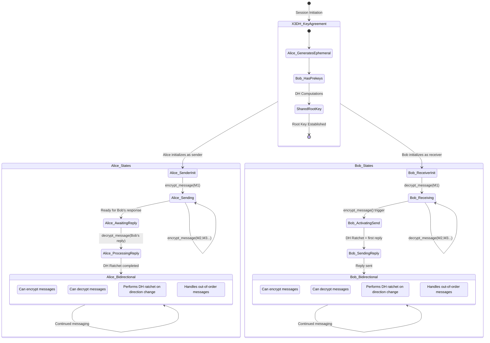

# Double Ratchet State Machine Documentation

## Overview

This document provides a comprehensive state-event diagram for the X3DH and Double Ratchet protocol implementation in the Cryptic messaging system. It shows how two users (Alice and Bob) synchronize their cryptographic ratchet states during a messaging session.

## Session Flow Summary

```
X3DH Key Agreement → Double Ratchet Init → Message Exchange → DH Ratchet Steps → Bidirectional Messaging

Alice: SENDER_INIT ──encrypt(M1)──► SENDING ──encrypt(M2,M3)──► AWAITING_REPLY ──decrypt(Reply)──► BIDIRECTIONAL
                                                                          ▲                               │
                                                                          │                               │
                                                                     [DH Ratchet]                         │
                                                                          │                               │
Bob:   RECEIVER_INIT ──decrypt(M1,M2,M3)──► RECEIVING ──encrypt(Reply)────┘                               │
                                                   │                                                      │
                                              [Auto DH Ratchet]                                           │
                                                   │                                                      │
                                                   ▼                                                      │
                                             BIDIRECTIONAL ◄──────────────────────────────────────────────┘
```

## Complete Session State Flow



## Detailed State Descriptions

### 1. X3DH Key Agreement Phase

**Initial State**: No shared secrets exist between Alice and Bob.

**Process**:
1. Alice fetches Bob's prekey bundle (identity key, signed prekey, one-time prekey)
2. Alice generates ephemeral key pair
3. Both parties perform 4 DH computations: `DH1 || DH2 || DH3 || DH4`
4. Shared root key derived: `RootKey = KDF(DH_OUTPUT)`

**Outcome**: Both parties have identical 32-byte root key for Double Ratchet initialization.

### 2. Double Ratchet Initialization

#### Alice (Sender) Initial State
```erlang
#ratchet_state{
    root_key = SharedRootKey,
    send_chain_key = KDF(RootKey, <<"init">>),
    recv_chain_key = KDF(RootKey, <<"resp">>),
    send_msg_number = 0,
    recv_msg_number = 0,
    dh_ratchet_step = 0,
    sending_chain_active = true,
    receiving_chain_active = true,
    dh_remote = undefined  % Set when Bob's first message received
}
```

#### Bob (Receiver) Initial State  
```erlang
#ratchet_state{
    root_key = SharedRootKey,
    send_chain_key = <<0:256>>,  % Not active yet
    recv_chain_key = KDF(RootKey, <<"init">>),  % Matches Alice's send chain
    send_msg_number = 0,
    recv_msg_number = 0,
    dh_ratchet_step = 0,
    sending_chain_active = false,
    receiving_chain_active = true,
    dh_remote = AliceDHPub  % Set from X3DH
}
```

### 3. Message Exchange States

#### Alice Sending Messages (M1, M2, M3...)

**State Transitions**:
- `encrypt_message(M1)`: `send_msg_number: 0 → 1`
- `encrypt_message(M2)`: `send_msg_number: 1 → 2` 
- `encrypt_message(M3)`: `send_msg_number: 2 → 3`

**Chain Operations**:
```erlang
{NewSendChain, MessageKey} = advance_sending_chain(CurrentSendChain, MsgNumber),
{EncKey, AuthKey} = kdf_mk(MessageKey),
{Ciphertext, Nonce} = aead_encrypt(Plaintext, EncKey)
```

#### Bob Receiving Messages

**State Transitions**:
- `decrypt_message(M1)`: `recv_msg_number: 0 → 1`
- `decrypt_message(M2)`: `recv_msg_number: 1 → 2`
- `decrypt_message(M3)`: `recv_msg_number: 2 → 3`

**Chain Operations**:
```erlang
{NewRecvChain, MessageKey} = advance_receiving_chain(CurrentRecvChain, MsgNumber),
{EncKey, AuthKey} = kdf_mk(MessageKey),
Plaintext = aead_decrypt(Ciphertext, EncKey, Nonce)
```

### 4. Critical Transition: Bob's First Reply

#### Trigger Event
```erlang
encrypt_message(ReplyText, BobState)
```

#### State Synchronization Process

**Bob's DH Ratchet Step**:
1. **Check**: `sending_chain_active = false` → Needs activation
2. **Generate**: New DH keypair `{BobNewDHPub, BobNewDHPriv}`
3. **Compute**: `DHOutput = scalarmult(BobNewDHPriv, AliceDHPub)`
4. **Derive**: `{NewRootKey, InitChain, RespChain} = kdf_rk(OldRootKey, DHOutput)`
5. **Update State**:
   ```erlang
   BobState#{
       dh_ratchet_step := 1,
       dh_self := {BobNewDHPub, BobNewDHPriv},
       send_chain_key := RespChain,  % Bob uses responder chain for sending
       sending_chain_active := true
   }
   ```

**Message Format**:
```erlang
#{
    dh_public => BobNewDHPub,      % New DH key signals ratchet step
    dh_step => 1,                  % Incremented step number
    msg_number => 0,               % First message in new chain
    ciphertext => EncryptedReply,
    nonce => Nonce
}
```

### 5. Alice Processes Bob's Reply

#### Trigger Event
```erlang
decrypt_message(BobReplyMessage, AliceState)
```

#### Alice's DH Ratchet Step

**Detection**: `dh_public` field contains new key different from stored `dh_remote`

**Process**:
1. **Extract**: `BobNewDHPub` from message
2. **Compute**: `DHOutput = scalarmult(AliceDHPriv, BobNewDHPub)`  
3. **Derive**: `{NewRootKey, InitChain, RespChain} = kdf_rk(OldRootKey, DHOutput)`
4. **Update Chains**:
   - **Send Chain**: `InitChain` (Alice uses initiator chain for sending)  
   - **Recv Chain**: `RespChain` (to match Bob's new sending chain)
5. **Generate New DH**: `{AliceNewDHPub, AliceNewDHPriv}` for future ratchet steps
6. **Reset Counters**: Both send/recv message numbers reset to 0 for new chains

**Synchronized State**:
```erlang
AliceState#{
    dh_ratchet_step := 1,
    dh_self := {AliceNewDHPub, AliceNewDHPriv},
    dh_remote := BobNewDHPub,
    root_key := NewRootKey,
    send_chain_key := InitChain,
    recv_chain_key := RespChain,
    send_msg_number := 0,
    recv_msg_number := 0
}
```

### 6. Bidirectional Messaging State

#### Characteristics
- Both parties have `sending_chain_active = true` and `receiving_chain_active = true`
- DH ratchet steps occur automatically on direction changes
- Out-of-order message handling via skipped key cache
- Forward secrecy through chain key advancement

#### Direction Change Detection

**Condition for DH Ratchet**:
```erlang
should_perform_dh_ratchet_on_send(State) ->
    HasReceivedMessages = State#ratchet_state.recv_msg_number > 0,
    FirstSendInDirection = State#ratchet_state.send_msg_number == 0,
    HasRemoteDH = State#ratchet_state.dh_remote =/= undefined,
    HasReceivedMessages andalso FirstSendInDirection andalso HasRemoteDH.
```

**DH Ratchet Process**:
1. Generate new ephemeral DH keypair
2. Compute shared secret with remote's current DH key
3. Derive new root key and chain keys
4. Reset message counters for new chains
5. Increment `dh_ratchet_step`

### 7. Out-of-Order Message Handling

#### Gap Detection
When `incoming_msg_number > expected_msg_number`:

1. **Calculate Gap**: `SkipCount = IncomingMsgNum - ExpectedMsgNum`
2. **Derive Skipped Keys**: Pre-compute message keys for all skipped messages
3. **Cache Keys**: Store in `skipped_keys` map with `{dh_step, msg_num}` as key
4. **Process Current**: Decrypt current message normally

#### Delayed Message Processing
When delayed message arrives:

1. **Lookup Key**: `KeyId = {DHStep, MsgNumber}`
2. **Retrieve**: Get cached message key from `skipped_keys[KeyId]`
3. **Decrypt**: Use cached key to decrypt message
4. **Forward Secrecy**: Remove used key from cache

## Error Conditions and Recovery

### Authentication Failures
- Invalid nonce/ciphertext → Reject message, maintain state
- Missing skipped key → Cannot decrypt, may indicate attack

### State Desynchronization  
- Mismatched DH step numbers → Re-negotiate session
- Excessive message gaps → Refuse further gaps (DoS protection)

### Security Boundaries
- Maximum skipped keys: 1000 (configurable)
- Maximum cache size: 10000 keys (configurable)  
- Key expiration: 24 hours (configurable)

## Implementation Notes

### Thread Safety
- Each ratchet state is independent and single-threaded
- No shared mutable state between Alice and Bob
- State updates are atomic within each operation

### Performance Considerations
- Native libsodium KDF operations (39x faster than Erlang)
- ChaCha20-Poly1305 AEAD encryption
- Efficient binary operations for key derivation
- LRU-style cleanup for expired skipped keys

### Debugging Support
- `get_state_info/1` provides non-sensitive state inspection
- Comprehensive test suite covers all transition scenarios
- Debug logging available via `?dbg` macros (disabled in production)

## Testing Coverage

The implementation includes comprehensive scenario tests covering:

1. **Basic Flow**: Alice sends → Bob receives → Bob replies → Alice receives
2. **Extended Offline**: Multiple messages with DH ratchets while offline
3. **Out-of-Order Delivery**: Messages arrive in wrong sequence
4. **Bidirectional**: Rapid back-and-forth messaging
5. **Session Persistence**: Serialization/deserialization of ratchet states
6. **Message Key Uniqueness**: Ensures no key reuse across messages

All tests validate state synchronization and cryptographic correctness.